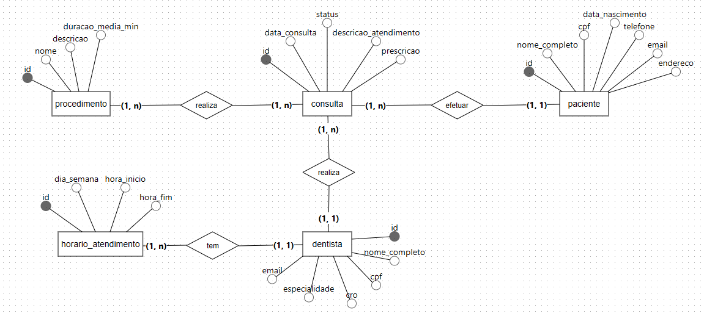
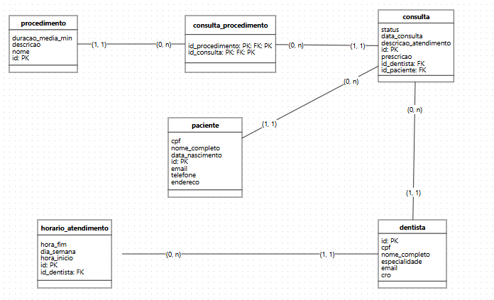

# 🦷 Dental Clinic Management System (DCMS)

<div align="center">
  
  
  
  
  
</div>

<br>

🇺🇸 English Version

## 📋 Table of Contents
- [About the Project](#-about-the-project)
- [Core Features](#-core-features)
- [Database Architecture](#-database-architecture)
- [Technical Highlights](#-technical-highlights)
- [How to Run](#-how-to-run)
- [Development Team](#-development-team)

---

## 📌 About the Project
This project consists of the design and implementation of a relational database system for managing a dental clinic.

The system was built to handle appointment scheduling, patient records, and professional management, with business rules enforced directly at the database level.

The architecture prioritizes:

* **Data integrity**
* **Query performance**
* **Referential consistency**

Providing a solid and production-ready foundation for backend applications.

---

## 🎯 Core Features
* **Patient Management:** Strict data validation (unique CPF, regex validation, valid birth dates).
* **Dentist Management:** Professional records including license (CRO) and specialties.
* **Schedule Control:** Dynamic weekly availability per dentist.
* **Appointments & Medical Records:** Status-based workflow (`Scheduled`, `Completed`, `Canceled`).
* **Procedure Catalog:** Many-to-many relationship allowing multiple procedures per appointment.

---

## 🏗️ Database Architecture
The database is fully normalized to eliminate redundancy and ensure consistency.

**Main Entities:**
1. `patient`
2. `dentist`
3. `appointment_schedule`
4. `procedure`
5. `appointment`
6. `appointment_procedure` *(N:N relationship)*

### 📊 Data Modeling (ERD)

<div align="center">
  
  
</div>

---

## ⚙️ Technical Highlights

* 🔒 **Referential Integrity**
  * `RESTRICT` prevents deletion of entities with existing relationships
  * `CASCADE` ensures automatic cleanup of dependent records

* ✅ **Data Validation**
  * CPF validation using regular expressions
  * Logical constraints for dates and time intervals
  * Unique constraints for critical fields

* 🚀 **Performance Optimization**
  * Strategic use of indexes for query acceleration
  * Analytical queries using aggregations and joins
  * Creation of views for simplified data access

---

## 🚀 How to Run

**Prerequisites:** PostgreSQL installed locally or in the cloud.

1. Clone this repository:
   ```bash
   git clone https://github.com/DevYuriVieira/dentacare-management-system.git
   ```

2. Open the file `database/script_banco_clinica.sql` in your preferred SQL client.

3. Execute the script completely. It includes:
   * **Database creation (DDL - Data Definition Language)**
   * **Data population (DML - Data Manipulation Language)**
   * **Analytical queries and views (DQL - Data Query Language)**

---

## 👥 Development Team

Developed as a final project for the **Serratec ICT Residency Program**, focused on relational database design and data integrity.

| Developer | GitHub |
| :--- | :---: |
| **Yuri Vieira** | https://github.com/DevYuriVieira |
| **Pedro Martins** | https://github.com/pedromartins01 |
| **Marcelo Ribeiro** | https://github.com/marceloribeiro-serratec |
| **Jhonata Raibolt** | https://github.com/jhonataraibolt |
| **Lucas Alves** | https://github.com/lucasalvesdacruz0807-stack |
| **Pedro Dayer** | https://github.com/PedroDayer |

---

# 🦷 Sistema de Gestão para Clínica Odontológica (SGO)

<div align="center">
  
  
  
  
  
</div>

<br>

🇧🇷 Versão em Português

## 📋 Índice
- [Sobre o Projeto](#-sobre-o-projeto)
- [Funcionalidades Principais](#-funcionalidades-principais)
- [Arquitetura do Banco de Dados](#-arquitetura-do-banco-de-dados)
- [Destaques Técnicos](#-destaques-técnicos)
- [Como Executar](#-como-executar)
- [Equipe de Desenvolvimento](#-equipe-de-desenvolvimento)

---

## 📌 Sobre o Projeto
Este projeto consiste na modelagem e implementação de um sistema de banco de dados relacional para a gestão de uma clínica odontológica.

O sistema foi desenvolvido para gerenciar o agendamento de consultas, registros de pacientes e controle de profissionais, com regras de negócio aplicadas diretamente no banco de dados.

A arquitetura prioriza:

* **Integridade dos dados**
* **Performance nas consultas**
* **Consistência referencial**

Fornecendo uma base sólida e pronta para uso em aplicações backend.

---

## 🎯 Funcionalidades Principais
* **Gestão de Pacientes:** Validação rigorosa de dados (CPF único, validação com regex, datas válidas).
* **Gestão de Dentistas:** Controle de registros profissionais (CRO) e especialidades.
* **Controle de Agenda:** Disponibilidade semanal dinâmica por dentista.
* **Consultas e Prontuário:** Fluxo baseado em status (`Agendada`, `Realizada`, `Cancelada`).
* **Catálogo de Procedimentos:** Relação muitos-para-muitos permitindo múltiplos procedimentos por consulta.

---

## 🏗️ Arquitetura do Banco de Dados
O banco de dados é totalmente normalizado para eliminar redundâncias e garantir consistência.

**Principais Entidades:**
1. `paciente`
2. `dentista`
3. `horario_atendimento`
4. `procedimento`
5. `consulta`
6. `consulta_procedimento` *(relação N:N)*

---

## 📊 Modelagem de Dados (DER)

<div align="center">
  
  
</div>

---

## ⚙️ Destaques Técnicos

* 🔒 **Integridade Referencial**
  * `RESTRICT` impede exclusões com vínculos existentes
  * `CASCADE` remove automaticamente dependências

* ✅ **Validação de Dados**
  * CPF com regex
  * Regras de data e tempo
  * Campos únicos

* 🚀 **Otimização de Performance**
  * Índices estratégicos
  * Queries analíticas
  * Views para simplificação

---

## 🚀 Como Executar

**Pré-requisitos:** PostgreSQL instalado.

1. Clone o repositório:
   ```bash
   git clone https://github.com/DevYuriVieira/dentacare-management-system.git
   ```

2. Abra `database/script_banco_clinica.sql`

3. Execute tudo:
   * **Criação do banco (DDL - Data Definition Language)**
   * **Manipulação de dados (DML - Data Manipulation Language)**
   * **Consultas (DQL - Data Query Language)**

---

## 👥 Equipe de Desenvolvimento

Projeto desenvolvido na **Residência em TIC do Serratec**, com foco em banco de dados.

| Desenvolvedor | GitHub |
| :--- | :---: |
| **Yuri Vieira** | https://github.com/DevYuriVieira |
| **Pedro Martins** | https://github.com/pedromartins01 |
| **Marcelo Ribeiro** | https://github.com/marceloribeiro-serratec |
| **Jhonata Raibolt** | https://github.com/jhonataraibolt |
| **Lucas Alves** | https://github.com/lucasalvesdacruz0807-stack |
| **Pedro Dayer** | https://github.com/PedroDayer |
